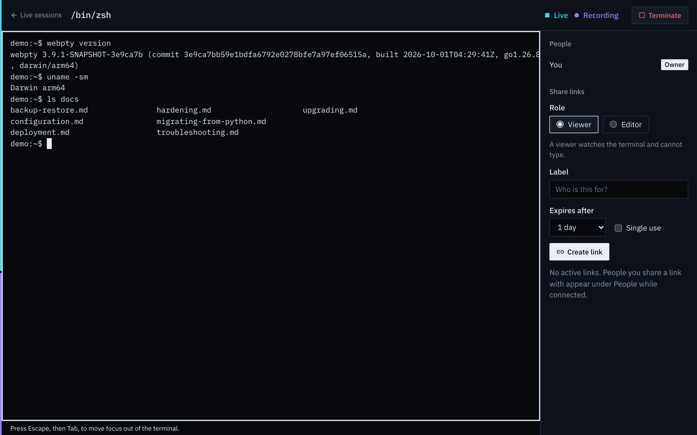
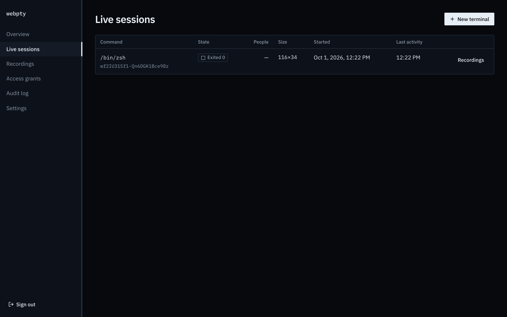
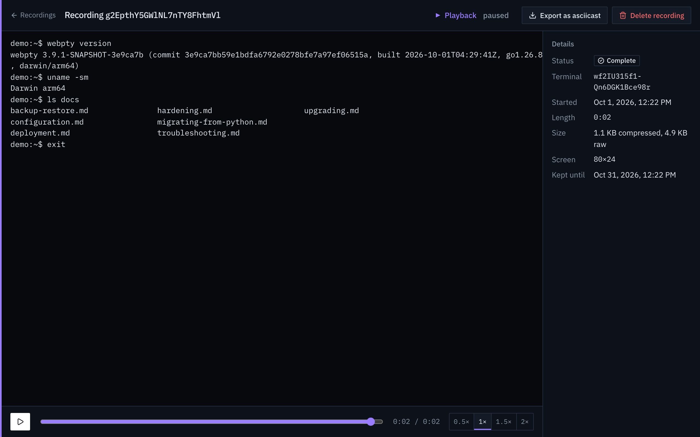
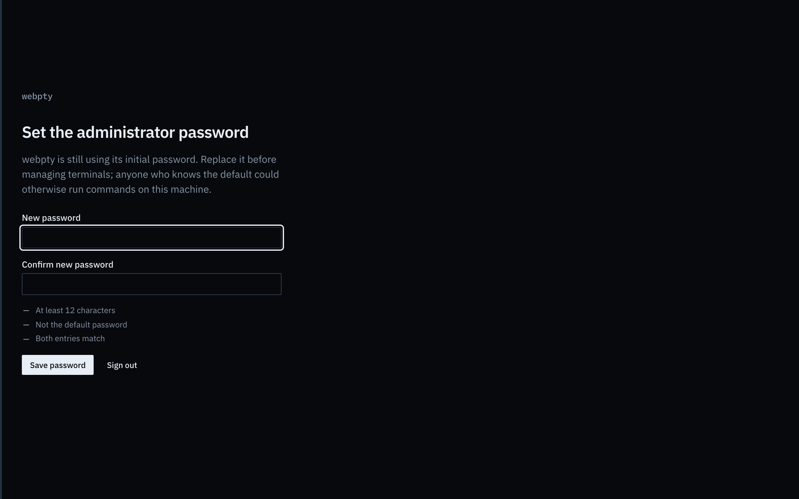

# webpty

[](https://github.com/0xPiranhaCodes/webpty/actions/workflows/ci.yml)
[](https://github.com/0xPiranhaCodes/webpty/actions/workflows/codeql-analysis.yml)

webpty serves real terminals to the browser. One self-contained binary runs
your shell (or any program) in a PTY and gives you a web console to open
terminals, share them with editors and viewers, record sessions, and play
them back.

- **Terminals in the browser**: full xterm.js terminals with resize, colors,
  and keyboard handling, backed by real PTYs on macOS and Linux.
- **Sharing**: invite an *editor* who can type or a *viewer* who can only
  watch, with expiring, revocable, optionally single-use links. Revoking a
  link disconnects its guests immediately.
- **Recording and playback**: sessions are recorded by default, with seekable
  playback in the console and export as [asciicast v2](https://docs.asciinema.org/manual/asciicast/v2/).
- **Administration** at `/admin`: live sessions, recordings, access grants,
  an audit log of every sign-in, share, and terminal, and the effective
  settings.
- **Secure defaults**: listens on `127.0.0.1` only, forces the first-run
  password to be changed, never runs commands through a shell, and passes
  terminals only an allowlisted environment.
- **Operations**: `webpty doctor`, online `backup`, and verified offline
  `restore`, with all state in one SQLite file.

## What it looks like

A live terminal, with the people connected and share links beside it:



Every session is listed under *Live sessions*, and its recording plays back
with a timeline and can be exported for asciinema:





On first run, nothing works until the `CHANGEME` password is replaced:



Guests open a shared link at `/join` and see only that terminal.

## Install

Release archives for macOS and Linux (amd64 and arm64) are published on the
[releases page](https://github.com/0xPiranhaCodes/webpty/releases) with
SHA-256 checksums, SBOMs, and Sigstore signatures. See
[docs/upgrading.md](docs/upgrading.md#verifying-a-release) to verify them.
Windows is not supported natively; use WSL or Docker.

**Install script** (verifies the checksum; no root needed, installs to `~/.local/bin`):

```sh
curl -fsSL https://raw.githubusercontent.com/0xPiranhaCodes/webpty/main/scripts/install.sh | sh
# or a specific version and directory:
curl -fsSL https://raw.githubusercontent.com/0xPiranhaCodes/webpty/v1.2.3/scripts/install.sh | sh -s -- --version 1.2.3 --bin-dir "$HOME/bin"
```

**Homebrew**: each release attaches a signed `webpty.rb` formula. Homebrew
installs formulae only from taps, so `homebrew-tap.sh` keeps one on this
machine (`webpty-local/webpty`). It verifies the formula against the
release's checksums and their Sigstore signature, then trusts and installs
that one formula. It needs
[cosign](https://docs.sigstore.dev/cosign/system_config/installation/)
(`brew install cosign`). Download the helper from the tag of the release
you install; each release's notes give the exact commands:

```sh
curl -fsSLO https://raw.githubusercontent.com/0xPiranhaCodes/webpty/v1.2.3/scripts/homebrew-tap.sh
sh homebrew-tap.sh --version 1.2.3
```

To upgrade, run the same two commands for the new release.

The signature must come from `--certificate-identity
https://github.com/0xPiranhaCodes/webpty/.github/workflows/release.yml@refs/tags/v<version>`;
see [docs/upgrading.md](docs/upgrading.md#homebrew).

**Binary archive**:

```sh
VERSION=1.2.3
curl -fsSLO https://github.com/0xPiranhaCodes/webpty/releases/download/v$VERSION/webpty_${VERSION}_darwin_arm64.tar.gz
curl -fsSLO https://github.com/0xPiranhaCodes/webpty/releases/download/v$VERSION/webpty_${VERSION}_checksums.txt
shasum -a 256 --check --ignore-missing webpty_${VERSION}_checksums.txt
tar -xzf webpty_${VERSION}_darwin_arm64.tar.gz webpty && ./webpty version
```

**Docker** (database on the `/data` volume, runs as an unprivileged user):

```sh
docker run -d --name webpty -p 127.0.0.1:8000:8000 -v webpty-data:/data ghcr.io/0xpiranhacodes/webpty:latest
```

**From source** (Go 1.26.8 and Node.js 22.23.2):

```sh
git clone https://github.com/0xPiranhaCodes/webpty && cd webpty
make build        # builds the web UI, embeds it, writes bin/webpty
```

## First run

```sh
webpty
```

webpty listens on <http://127.0.0.1:8000> and creates `webpty.db` in the
current directory. Sign in at `/admin` with the password **`CHANGEME`**. You
must choose a new password before you can do anything else; until then every
other action is refused, and `CHANGEME` stops working once it is changed.

Then:

1. **Open a terminal** from *Live sessions → New terminal*. It runs `$SHELL`
   (or the command you configured) in a PTY that lives on the server; closing
   the browser tab does not end it.
2. **Share it** from the terminal's side panel. An *editor* link lets the
   guest type; a *viewer* link is read-only. Links expire, can be limited to
   one use, and can be revoked at any time (also from *Access grants*), which
   disconnects their guests.
3. **Play it back** from *Recordings*, or *Export as asciicast*.
4. **Review** sign-ins, shares, and terminals in the *Audit log*.

## Running beyond this machine

By default webpty accepts connections from this machine only. A browser
terminal is a shell on your server, so expose it to a network only behind a
reverse proxy that terminates TLS, and tell webpty the URL browsers use:

```sh
WEBPTY_ADDRESS=127.0.0.1:8000 WEBPTY_PUBLIC_ORIGIN=https://pty.example.com webpty
```

webpty refuses to listen on a non-loopback address without
`WEBPTY_PUBLIC_ORIGIN`, and sets secure cookies automatically for an `https`
origin. See [docs/deployment.md](docs/deployment.md) for nginx, Caddy,
systemd, launchd, and Docker examples.

## What terminals may run and inherit

Commands are executed directly, never through a shell, so `--cmd` names one
executable and its arguments follow `--`. Restrict what terminals may run with
`WEBPTY_COMMAND_ALLOW` and `WEBPTY_COMMAND_DENY` (absolute paths). Terminals
do not inherit webpty's environment: they get `HOME`, `USER`, `PATH`, locale
settings and a few more, plus anything you name in
`WEBPTY_CHILD_ENV_PASSTHROUGH`. See [docs/hardening.md](docs/hardening.md).

## Command line

```sh
webpty                                   # serve with defaults (same as webpty serve)
webpty -p 9000                           # another port, still on 127.0.0.1
webpty -c /usr/bin/htop                  # terminals run htop instead of $SHELL
webpty --cmd /usr/bin/tmux -- new -A -s main
webpty serve --database /var/lib/webpty/webpty.db --public-origin https://pty.example.com --address 127.0.0.1:8000
webpty version                           # version, commit, build date (--json available)
webpty doctor                            # check this host and configuration; changes nothing
webpty backup --output webpty-backup.db  # consistent copy, safe while serving
webpty restore --input webpty-backup.db  # offline; keeps a rollback copy
webpty help
```

Every flag has a `WEBPTY_*` environment variable; flags win. The full list is
in [docs/configuration.md](docs/configuration.md).

## Documentation

- [Canonical product and repository specification](docs/specs/product.md)
- [Configuration reference](docs/configuration.md)
- [Deployment, TLS, and reverse proxies](docs/deployment.md)
- [Hardening: command policy, environment, limits](docs/hardening.md)
- [Backup, restore, and disaster recovery](docs/backup-restore.md)
- [Upgrading and verifying releases](docs/upgrading.md)
- [Troubleshooting and `webpty doctor`](docs/troubleshooting.md)
- [Migrating from the original webpty](docs/migrating-from-python.md)

## Development

```sh
make web-install   # npm ci for the web UI
make check         # formatting, vet, race tests, cross builds, frontend checks, vulnerability and secret scans, release lint
make e2e           # Chromium and WebKit end-to-end and accessibility suites
make snapshot      # local release archives and formula in dist/ with checksum, SBOM, and clean-install checks
```

Prerequisites: Go 1.26.8 (the toolchain in `go.mod`; any newer Go
downloads it automatically), Node.js 22.23.2 with npm, git,
and curl. `make check` also needs [shellcheck](https://www.shellcheck.net/)
and [hadolint](https://github.com/hadolint/hadolint) on `PATH`. Without them,
run hadolint through Docker:
`make check HADOLINT="docker run --rm -i hadolint/hadolint hadolint -" HADOLINT_INPUT="< Dockerfile"`.
`make snapshot` needs [syft](https://github.com/anchore/syft), and `make e2e`
needs `npx playwright install chromium webkit` once. `make
homebrew-validate` needs Homebrew, and the `docker-*` targets need a Docker
daemon.

## Contributing and community

webpty is maintainer-led. Before proposing a change, review the contribution
guide and open an issue to discuss larger changes so scope and approach can be
agreed before implementation.

- [Contributing guide](CONTRIBUTING.md)
- [Code of Conduct](CODE_OF_CONDUCT.md)
- [Security policy and private vulnerability reporting](SECURITY.md)
- [Support channels](SUPPORT.md)

## License

[MIT](LICENSE)
