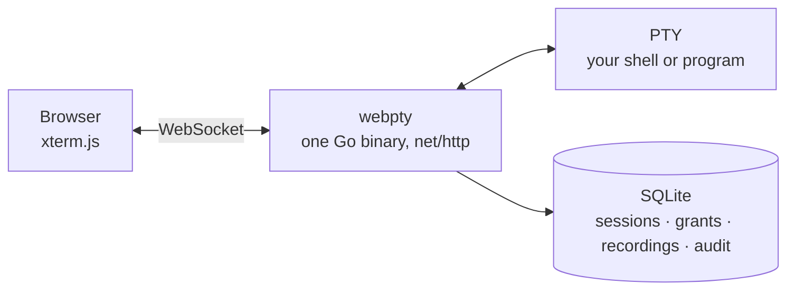

<div align="center">

# webpty

**Real terminals in the browser. One binary. Secure by default.**

[](https://github.com/0xPiranhaCodes/webpty/actions/workflows/ci.yml)
[](https://github.com/0xPiranhaCodes/webpty/actions/workflows/codeql-analysis.yml)
[](https://github.com/0xPiranhaCodes/webpty/releases)
[](go.mod)
[](#install)
[](LICENSE)

[Install](#install) · [First run](#first-run) · [Security defaults](#security-defaults) · [Command line](#command-line) · [Documentation](#documentation)

</div>

webpty runs your shell, or any program, in a PTY on the server and serves it
to the browser. Open terminals, hand an *editor* or *viewer* link to someone
else, record every session, and play it back. All state lives in one SQLite
file, and the web UI is embedded in the binary, so there is nothing else to
install or host.


> webpty 1.0 is a complete rewrite in Go of the original webpty. If you ran
> an earlier version, see
> [docs/migrating-from-python.md](docs/migrating-from-python.md).

## What you get

| | |
| --- | --- |
| **Terminals in the browser** | Full [xterm.js](https://xtermjs.org) terminals with resize, colors, and keyboard handling, backed by real PTYs on macOS and Linux. Closing the tab does not end the terminal. |
| **Sharing** | Invite an *editor* who can type or a *viewer* who can only watch. Links expire, can be single-use, and can be revoked at any time. Revoking disconnects its guests immediately. |
| **Recording and playback** | Sessions are recorded by default. Scrub through them in the console or export [asciicast v2](https://docs.asciinema.org/manual/asciicast/v2/) for asciinema. Keystrokes are never recorded, only output. |
| **Administration** | `/admin` shows live sessions, recordings, access grants, the effective settings, and an audit log of every sign-in, share, and terminal. |
| **Operations** | `webpty doctor` checks the host, online `backup`, verified offline `restore`, and a `/healthz` endpoint. |
| **Supply chain** | Reproducible builds, SHA-256 checksums, SPDX SBOMs, Sigstore signatures, and GitHub build provenance on every release. |

<details>
<summary><strong>More screenshots</strong></summary>

Every session is listed under *Live sessions*:


Recordings play back with a timeline and export for asciinema:


On first run, nothing works until the `CHANGEME` password is replaced:


</details>

## How it works



The server owns the PTYs, authorizes every request and WebSocket, fans output
out to everyone connected, and writes the recording. Guests open `/join` with
a capability link and see only that terminal. Plaintext capabilities are shown
once, at creation; the database stores only their hashes.

## Install

Releases ship for macOS and Linux on amd64 and arm64. Windows is not
supported natively; use WSL or Docker.

**Install script** (verifies the checksum; no root needed; installs to `~/.local/bin`):

```sh
curl -fsSL https://raw.githubusercontent.com/0xPiranhaCodes/webpty/main/scripts/install.sh | sh
# or a specific version and directory:
curl -fsSL https://raw.githubusercontent.com/0xPiranhaCodes/webpty/v1.0.0/scripts/install.sh | sh -s -- --version 1.0.0 --bin-dir "$HOME/bin"
```

**Homebrew**: each release attaches a signed `webpty.rb` formula. Homebrew
installs formulae only from taps, so `homebrew-tap.sh` keeps one on this
machine (`webpty-local/webpty`), verifies the formula against the release's
checksums and their Sigstore signature, then installs that one formula. It
needs [cosign](https://docs.sigstore.dev/cosign/system_config/installation/)
(`brew install cosign`). Download the helper from the tag of the release
you install; each release's notes give the exact commands:

```sh
curl -fsSLO https://raw.githubusercontent.com/0xPiranhaCodes/webpty/v1.0.0/scripts/homebrew-tap.sh
sh homebrew-tap.sh --version 1.0.0
```

To upgrade, run the same two commands for the new version. The signature must
come from `--certificate-identity
https://github.com/0xPiranhaCodes/webpty/.github/workflows/release.yml@refs/tags/v<version>`;
see [docs/upgrading.md](docs/upgrading.md#homebrew).

**Docker** (database on the `/data` volume, runs as an unprivileged user):

```sh
docker run -d --name webpty -p 127.0.0.1:8000:8000 -v webpty-data:/data ghcr.io/0xpiranhacodes/webpty:latest
```

**Binary archive**:

```sh
VERSION=1.0.0
curl -fsSLO https://github.com/0xPiranhaCodes/webpty/releases/download/v$VERSION/webpty_${VERSION}_darwin_arm64.tar.gz
curl -fsSLO https://github.com/0xPiranhaCodes/webpty/releases/download/v$VERSION/webpty_${VERSION}_checksums.txt
shasum -a 256 --check --ignore-missing webpty_${VERSION}_checksums.txt
tar -xzf webpty_${VERSION}_darwin_arm64.tar.gz webpty && ./webpty version
```

[docs/upgrading.md](docs/upgrading.md#verifying-a-release) shows how to
verify the signatures and provenance of any download.

**From source** (Go 1.26.8 and Node.js 22.23.2):

```sh
git clone https://github.com/0xPiranhaCodes/webpty && cd webpty
make build        # builds the web UI, embeds it, writes bin/webpty
```

## First run

```sh
webpty
```

webpty listens on <http://127.0.0.1:8000> and creates `webpty.db` in the
current directory. Sign in at `/admin` with the password **`CHANGEME`**. You
must choose a new password before you can do anything else; until then every
other action is refused, and `CHANGEME` stops working once it is changed.

Then:

1. **Open a terminal** from *Live sessions → New terminal*. It runs `$SHELL`
   (or the command you configured) in a PTY that lives on the server.
2. **Share it** from the terminal's side panel. An *editor* link lets the
   guest type; a *viewer* link is read-only. Links expire, can be limited to
   one use, and can be revoked at any time (also from *Access grants*), which
   disconnects their guests.
3. **Play it back** from *Recordings*, or *Export as asciicast*.
4. **Review** sign-ins, shares, and terminals in the *Audit log*.

## Security defaults

A browser terminal is a shell on your server, so the defaults are strict and
every loosening is explicit.

| Default | What it means |
| --- | --- |
| Listens on `127.0.0.1` only | Binding any other address is refused unless `WEBPTY_PUBLIC_ORIGIN` names the URL browsers will use. |
| Forced first-run password change | Every other operation returns an error until `CHANGEME` is replaced. |
| No shell between webpty and your command | Commands run with `exec`, so arguments are passed literally and nothing is interpolated. |
| Allowlisted child environment | Terminals inherit `HOME`, `USER`, `PATH`, locale and time zone, and only what you name in `WEBPTY_CHILD_ENV_PASSTHROUGH`. `WEBPTY_*` variables are never passed. |
| Capabilities stored as hashes | A share link's secret is displayed once; the database keeps only its hash, scope, expiry, and revocation state. |
| Server-side authorization everywhere | Every API request and WebSocket message is checked on the server. Viewers cannot type, and revocation ends live connections. |
| Same-origin and CSRF checks | Cross-origin requests are rejected, and state-changing requests need a CSRF token. Cookies are `Secure` automatically for an `https` origin. |
| Recordings never contain input | Output, resizes, lifecycle, and presence are recorded; keystrokes are not, and never reach logs or audit details either. |

Found a vulnerability? Please report it privately as described in
[SECURITY.md](SECURITY.md).

## Running beyond this machine

Expose webpty to a network only behind a reverse proxy that terminates TLS,
and tell webpty the URL browsers use:

```sh
WEBPTY_ADDRESS=127.0.0.1:8000 WEBPTY_PUBLIC_ORIGIN=https://pty.example.com webpty
```

See [docs/deployment.md](docs/deployment.md) for nginx, Caddy, systemd,
launchd, and Docker examples.

## What terminals may run and inherit

Commands are executed directly, never through a shell, so `--cmd` names one
executable and its arguments follow `--`. Restrict what terminals may run with
`WEBPTY_COMMAND_ALLOW` and `WEBPTY_COMMAND_DENY` (absolute paths). See
[docs/hardening.md](docs/hardening.md).

## Command line

```sh
webpty                                   # serve with defaults (same as webpty serve)
webpty -p 9000                           # another port, still on 127.0.0.1
webpty -c /usr/bin/htop                  # terminals run htop instead of $SHELL
webpty --cmd /usr/bin/tmux -- new -A -s main
webpty serve --database /var/lib/webpty/webpty.db --public-origin https://pty.example.com --address 127.0.0.1:8000
webpty version                           # version, commit, build date (--json available)
webpty doctor                            # check this host and configuration; changes nothing
webpty backup --output webpty-backup.db  # consistent copy, safe while serving
webpty restore --input webpty-backup.db  # offline; keeps a rollback copy
webpty help
```

Every flag has a `WEBPTY_*` environment variable; flags win. The full list is
in [docs/configuration.md](docs/configuration.md).

## Documentation

| | |
| --- | --- |
| [Product and repository specification](docs/specs/product.md) | The canonical statement of what webpty is and is not |
| [Configuration reference](docs/configuration.md) | Every flag, environment variable, and default |
| [Deployment](docs/deployment.md) | TLS, reverse proxies, systemd, launchd, Docker |
| [Hardening](docs/hardening.md) | Command policy, child environment, limits |
| [Backup and restore](docs/backup-restore.md) | Online backups, verified restores, disaster recovery |
| [Upgrading](docs/upgrading.md) | Verifying releases, Homebrew, how releases are made |
| [Troubleshooting](docs/troubleshooting.md) | Common problems and `webpty doctor` |
| [Migrating from the original webpty](docs/migrating-from-python.md) | What changed from the earlier versions |

## Development

```sh
make web-install   # npm ci for the web UI
make check         # formatting, vet, race tests, cross builds, frontend checks, vulnerability and secret scans, release lint
make e2e           # Chromium and WebKit end-to-end and accessibility suites
make snapshot      # local release archives and formula in dist/ with checksum, SBOM, and clean-install checks
```

Prerequisites: Go 1.26.8 (the toolchain in `go.mod`; any newer Go
downloads it automatically), Node.js 22.23.2 with npm, git,
and curl. `make check` also needs [shellcheck](https://www.shellcheck.net/)
and [hadolint](https://github.com/hadolint/hadolint) on `PATH`. Without them,
run hadolint through Docker:
`make check HADOLINT="docker run --rm -i hadolint/hadolint hadolint -" HADOLINT_INPUT="< Dockerfile"`.
`make snapshot` needs [syft](https://github.com/anchore/syft), and `make e2e`
needs `npx playwright install chromium webkit` once. `make
homebrew-validate` needs Homebrew, and the `docker-*` targets need a Docker
daemon. [CONTRIBUTING.md](CONTRIBUTING.md) lists every tool and the command
to run it alone.

## Contributing and community

webpty is maintainer-led. Before proposing a change, review the contribution
guide and open an issue to discuss larger changes so scope and approach can be
agreed before implementation.

- [Contributing guide](CONTRIBUTING.md)
- [Code of Conduct](CODE_OF_CONDUCT.md)
- [Security policy and private vulnerability reporting](SECURITY.md)
- [Support channels](SUPPORT.md)

## License

[MIT](LICENSE)
